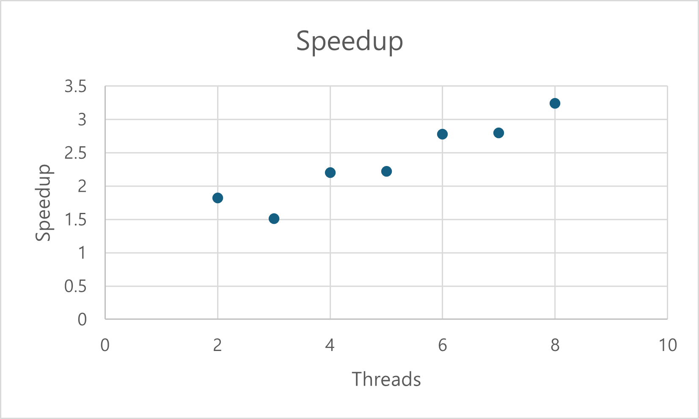
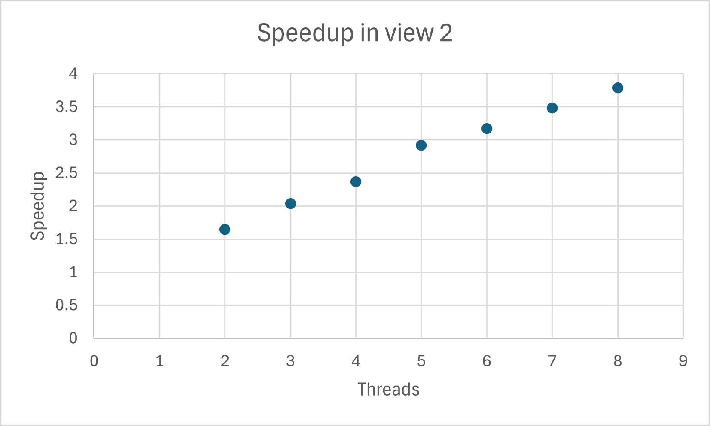
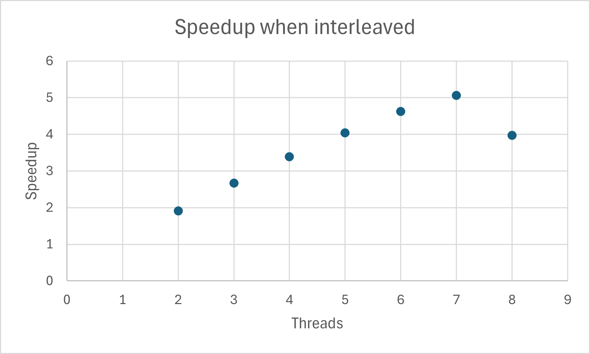
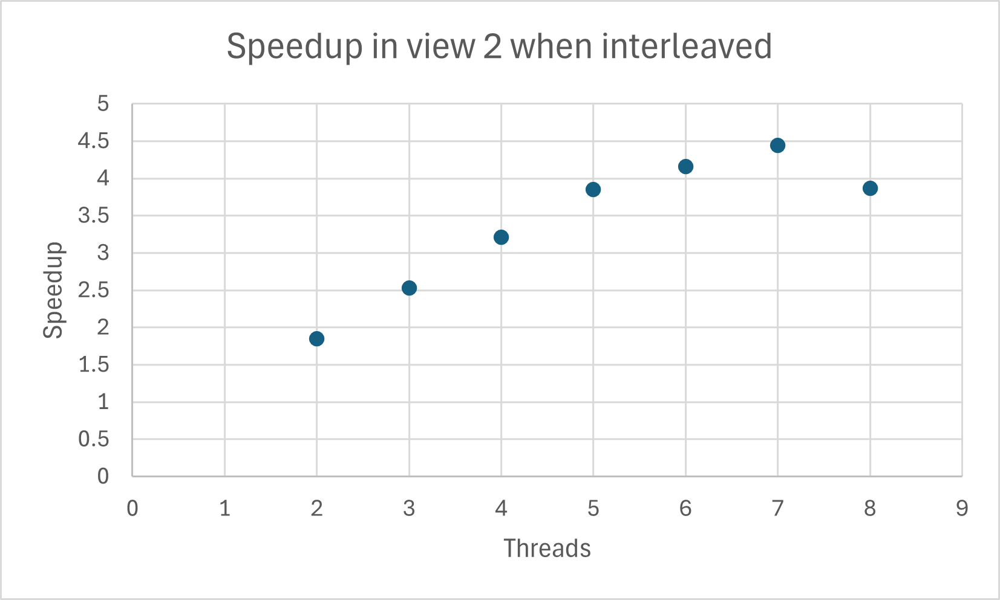

# 2개의 thread를 사용해 공간 분해
다음과 같이 코드를 수정했다. 이때 thread 개수 확장성을 위해 `numThreads` 변수를 사용하였다. 한편 thread 개수가 7개인 경우 remainder가 있어 일부 행이 실행되지 않는 문제가 발생하여 remainder를 더해주기로 하였고, 이를 위해 각 thread의 argument를 저장하는 structure에 두 개의 변수(`startRow`, `numRows`)를 추가하였다. 
```cpp
void workerThreadStart(WorkerArgs * const args) {

    mandelbrotSerial(args->x0, args->y0, args->x1, args->y1, args->width, args->height, args->startRow, args->numRows, args->maxIterations, args->output);
    // printf("Hello world from thread %d\n", args->threadId);
}
```
```cpp
for (int i=0; i<numThreads; i++) {
        args[i].x0 = x0;
        args[i].y0 = y0;
        args[i].x1 = x1;
        args[i].y1 = y1;
        args[i].width = width;
        args[i].height = height;
        args[i].startRow = i * (height / numThreads);
        args[i].numRows = height / numThreads;
        if (i == numThreads - 1) args[i].numRows += height % numThreads; // last rows
        args[i].maxIterations = maxIterations;
        args[i].numThreads = numThreads;
        args[i].output = output;
        
        args[i].threadId = i;
    }
```
```
[mandelbrot thread] : [275.387] ms
Wrote image file mandelbrot—thread.ppm (1.82x speedup frm 2 threads)
```
2개의 thread를 사용했을 때 1.82배의 speedup이 있었다. 

# Block을 이용한 2-8개 thread로 확장
여러 개의 thread를 사용했을 때 speedup은 아래의 그래프와 같다. 
<p align = "center">

</p>
현재 사용중인 system은 4개의 core를 가지며, 하나의 core당 2개의 thread를 사용한다. 이때 speedup이 linear하지 않고, 쓰레드가 3개일 때 speedup이 감소함을 확인할 수 있다. 
한편 view 2의 경우 speedup의 결과는 아래와 같다. 
<p align = "center">

</p>
view 1에 비해 linear한 speedup이 있음을 확인할 수 있다. 

View 2의 경우 `main()` 함수에서
```cpp
        case 'v':
        {
            int viewIndex = atoi(optarg);
            // change view settings
            if (viewIndex == 2) {
                float scaleValue = .015f;
                float shiftX = -.986f;
                float shiftY = .30f;
                scaleAndShift(x0, x1, y0, y1, scaleValue, shiftX, shiftY);
            } else if (viewIndex > 1) {
                fprintf(stderr, "Invalid view index\n");
                return 1;
            }
            break;
        }
```
계산하는 영역을 바꾸는 것을 확인할 수 있다. 

Mandelbrot 집합의 경우 수학적으로는 복소수 $c$에 대해 $z_{n+1}^2=z_n^2+c$ 연산을 반복적으로 수행하는데, 컴퓨터 연산의 경우 최대 연산 횟수를 정하고 반복하는 중 $(z_n)$의 절댓값이 4를 넘는 경우 발산한다고 표시하고, 그렇지 않고 최대 연산 횟수에 도달하는 경우 수렴한다고 표시한다. 
```cpp
static inline int mandel(float c_re, float c_im, int count)
{
    float z_re = c_re, z_im = c_im;
    int i;
    for (i = 0; i < count; ++i) {

        if (z_re * z_re + z_im * z_im > 4.f)
            break;

        float new_re = z_re*z_re - z_im*z_im;
        float new_im = 2.f * z_re * z_im;
        z_re = c_re + new_re;
        z_im = c_im + new_im;
    }

    return i;
}
```
이때 발산하는 지점들은 수렴하거나 경계에 가까운 점들에 비해 연산 속도가 빠를 것이다. 해당 코드에서는 영역을 단순히 row 단위로 쪼개었는데, 이때 view 1에서 가운데 영역의 경우 연산량이 가장자리 영역에 비해 많을 것이다. 따라서 각 thread 간에 연산량이 다른 것이 speedup에 bottleneck이 될 것임을 예측할 수 있다. 

view 2의 경우에는 위의 그림에서 보듯 연산량이 더 고르다. 따라서 각 thread 간의 연산량의 차이가 더 크지 않을 것이고, view 1보다 linear한 speedup이 가능한 것이라는 예상을 할 수 있다. 

# 개별 thread 시간 측정
이 예상을 확인해보기 위해 View 1의 경우 각각의 thread에서 소요되는 시간을 측정해보았다. 
```
Thread 7 finished in 10.9361 milliseconds
Thread 0 finished in 32.0838 milliseconds
Thread 1 finished in 60.4489 milliseconds
Thread 6 finished in 60.8097 milliseconds
Thread 5 finished in 105.9866 milliseconds
Thread 2 finished in 110.9109 milliseconds
Thread 4 finished in 147.6965 milliseconds
Thread 3 finished in 154.1761 milliseconds
```
실제로 각 thread간의 시간 차이가 큼을 확인할 수 있었다. 또한 가장자리를 계산하는 thread가 가운데를 계산하는 thread와 비교했을 때 더 빠름을 확인할 수 있었다. 따라서 예상이 맞음을 확인할 수 있다. 

# 속도 향상 개선
interleaved 방식을 사용할 경우 하나의 thread에 task가 몰리지 않게 되어 각 thread의 연산량이 비슷해져 speedup을 개선할 수 있을 것이다. 

이를 위해 thread의 시작점인 `workerThreadStart()` 함수를 수정하였다. 기존의 `mandelbrotSerial()` 함수는 interleaved 방식을 지원하지 않기 때문에 새로 작성하였으며 이를 위해 `mandelbrotThread.cpp`에 `mandel()` 함수를 추가하였다. 
```cpp
void workerThreadStart(WorkerArgs * const args) {

    // double startTime = CycleTimer::currentSeconds();
    // mandelbrotSerial(args->x0, args->y0, args->x1, args->y1, args->width, args->height, args->startRow, args->numRows, args->maxIterations, args->output);

    float dx = (args->x1 - args->x0) / args->width;
    float dy = (args->y1 - args->y0) / args->height;

    for (unsigned int j = args->threadId; j < args->height; j += args->numThreads) {
        float y = args->y0 + j * dy;
        for (unsigned int i = 0; i < args->width; ++i) {
            float x = args->x0 + i * dx;
            int index = (j * args->width + i);
            args->output[index] = mandel(x, y, args->maxIterations);
        }
    }
    
    // double endTime = CycleTimer::currentSeconds();
    // printf("Thread %d finished in %.4f milliseconds\n", args->threadId, (endTime - startTime) * 1000);
}
```

이때의 View 1 결과는 아래와 같다. 
<p align = "center">

</p>
전체적으로 blocked 방식을 사용했을 때와 비교해 linear한 speedup을 보인다. 그러나 thread가 8개일 때 갑자기 speedup이 감소하며 원하는 speedup인 7-8배에 도달하지 못한다. 

이를 확인하기 위해 각각의 thread에서 소요되는 시간을 측정해보았다. 
thread가 2개인 경우 아래와 같다. 
```
Thread 1 finished in 272.9602 milliseconds
Thread 0 finished in 274.5131 milliseconds
```
thread가 8개인 경우 아래와 같다. 
```
Thread 6 finished in 97.3525 milliseconds
Thread 4 finished in 100.0966 milliseconds
Thread 2 finished in 101.7974 milliseconds
Thread 3 finished in 105.9171 milliseconds
Thread 1 finished in 111.9000 milliseconds
Thread 5 finished in 114.5842 milliseconds
Thread 0 finished in 116.8760 milliseconds
Thread 7 finished in 110.3851 milliseconds
```
각각의 thread의 실행 시간이 비슷한 값을 가지지만, thread가 8개인 경우 유의미하게 시간이 줄어들지 않았다. 

이는 두 가지 이유로 예상해 볼 수 있는데, 먼저 각 8개 thread에서 부동 소수점 연산을 위해 자원을 요구하여 서로 경합하기 때문이고, 또한 8개의 thread의 context switch overhead가 존재하기 때문이다. 

한편 View 2의 경우 결과는 아래와 같다. 
<p align = "center">

</p>
View 1과 비슷하게 speedup은 어느 정도 증가했으나 thread가 8개일 때 speedup이 감소하는 현상을 보이며, 이는 위와 비슷한 이유로 추정된다. 

# 16개 thread
thread가 16개일 때도 8개일 때와 비교했을 때 speedup이 크게 없을 것이라고 예상할 수 있다. 