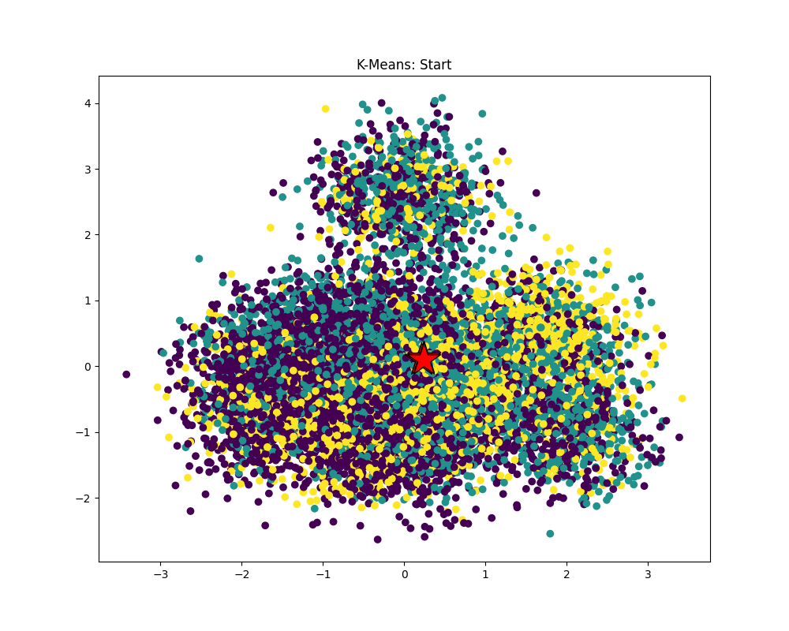
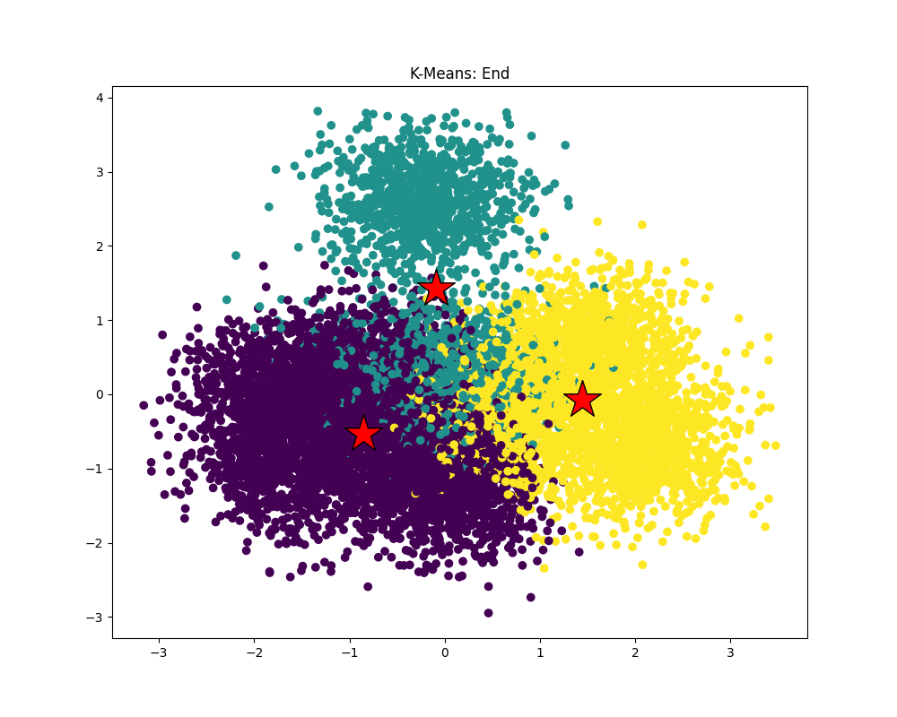

# k-means algorithm의 동작 확인
실행 결과는 아래와 같다. 

 

K-means algorithm이 잘 동작함을 확인할 수 있었다. 이때 실행 시간은 아래와 같다. 
```
Running K-means with: M=1000000, N=100, K=3, epsilon=0.100000
[Total Time]: 9956.010 ms
```
시간이 굉장히 오래 걸림을 확인할 수 있다. 

# 성능 병목 현상 확인
4개의 함수 `dist()`, `computeAssignements()`, `computeCentroids()`, `computeCost()`의 실행 시간을 확인해보면 아래와 같다. 
```
[Total Time]: 15035.988 ms
[Dist Time]: 11352.104 ms
[ComputeAssignments Time]: 10690.674 ms
[ComputeCentroids Time]: 1176.086 ms
[ComputeCost Time]: 3169.165 ms
```
여기서 `computeAssignments()` 함수가 실행 시간을 굉장히 많이 먹고 있음을 확인할 수 있다. 따라서 해당 함수를 병렬화하여야 한다. 

원래의 함수를 보면
```cpp
void computeAssignments(WorkerArgs *const args) {
  double *minDist = new double[args->M];
  
  // Initialize arrays
  for (int m =0; m < args->M; m++) {
    minDist[m] = 1e30;
    args->clusterAssignments[m] = -1;
  }

  // Assign datapoints to closest centroids
  for (int k = args->start; k < args->end; k++) {
    for (int m = 0; m < args->M; m++) {
      double d = dist(&args->data[m * args->N],
                      &args->clusterCentroids[k * args->N], args->N);
      if (d < minDist[m]) {
        minDist[m] = d;
        args->clusterAssignments[m] = k;
      }
    }
  }

  free(minDist);
}
```

아래의 이중 for문을 병렬화하면 좋을 것이다. 따라서 해당하는 부분만 따로 떼어 `workerThreadStart()` 함수로 만들어준다. 

이때 `minDist[]`의 값이 계속해서 업데이트되므로 k의 값을 기준으로 workload를 분배하면 여러 thread가 같은 `minDist[]`에 쓰는 문제가 생긴다. 따라서 m의 값을 기준으로 workload를 분배하면 될 것이다. 이를 위해서 for문의 k와 m의 위치를 바꾸었다. 
```cpp
void workerThreadStart(WorkerArgsThread * const args) {
  // Assign datapoints to closest centroids
  for (int m = args->start; m < args->end; m++) {
    for (int k = 0; k < args->K; k++) {
      double d = dist(&args->data[m * args->N],
                      &args->clusterCentroids[k * args->N], args->N);
      if (d < args->minDist[m]) {
        args->minDist[m] = d;
        args->clusterAssignments[m] = k;
      }
    }
  }
}
```

또한 각각의 worker thread의 args 구조체는 `mindist[]` 배열을 알고 있어야 하므로 이를 구조체에 추가했다. 다른 args 구조체는 `mindist[]`를 사용하지 않으므로 구조체를 상속해 사용하였다. 
```cpp
typedef struct : public WorkerArgs{
  double *minDist;
} WorkerArgsThread;
```

그리고 computeAssignments() 함수에서 각 thread의 args 구조체를 할당해주었다. 
```cpp
void computeAssignments(WorkerArgs *const args) {
  double *minDist = new double[args->M];
  int numThreads = ; // number of threads
  static constexpr int MAX_THREADS = 32;

  // Initialize arrays
  for (int m =0; m < args->M; m++) {
    minDist[m] = 1e30;
    args->clusterAssignments[m] = -1;
  }

  std::thread workers[MAX_THREADS];
  WorkerArgsThread args_thread[MAX_THREADS];
  for(int i=0;i<numThreads;i++)
  {
    args_thread[i].data = args->data;
    args_thread[i].clusterCentroids = args->clusterCentroids;
    args_thread[i].clusterAssignments = args->clusterAssignments;
    args_thread[i].minDist = minDist;
    args_thread[i].currCost = args->currCost;
    args_thread[i].M = args->M;
    args_thread[i].N = args->N;
    args_thread[i].K = args->K;
    args_thread[i].start = (args->M / numThreads) * i;
    args_thread[i].end = (args->M / numThreads) * (i + 1);
    if(i == numThreads - 1) args_thread[i].end = args->M; // if M % numThreads != 0
  }

  for (int i=1; i<numThreads; i++) {
    workers[i] = std::thread(workerThreadStart, &args_thread[i]);
  }
  workerThreadStart(&args_thread[0]);
  // join worker threads
  for (int i=1; i<numThreads; i++) {
    workers[i].join();
  }

  free(minDist);
}
```

`numThreads`를 8로 설정했을 때 실행시간은 아래와 같다. 
```
Running K-means with: M=1000000, N=100, K=3, epsilon=0.100000
[Total Time]: 4347.045 ms
```
speedup이 2배 이상임을 확인할 수 있다. 

한편 `numThreads`를 4로 설정한 경우 실행시간은 아래와 같다. 
```
Running K-means with: M=1000000, N=100, K=3, epsilon=0.100000
[Total Time]: 5180.704 ms
```
numThreads가 8일 때보다 실행 시간이 늘어났음을 확인할 수 있다. 이때 실행하는 CPU는 intel의 Tiger Lake 아키텍쳐로, 4 core 8 thread 구조이다. 앞의 `workerThreadStart()` 함수를 보면 메모리에 접근하고 쓰는 연산이 많음을 확인할 수 있는데, 이로 인해 발생하는 stall을 thread context switch를 통해 가려주는 효과가 있다. 